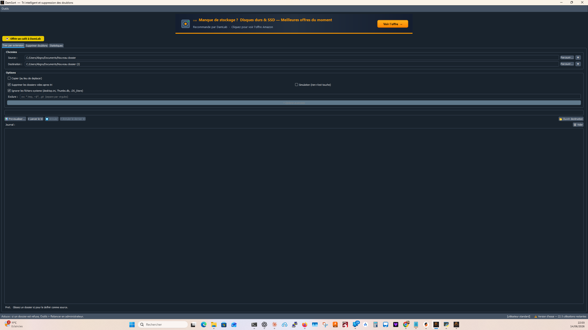
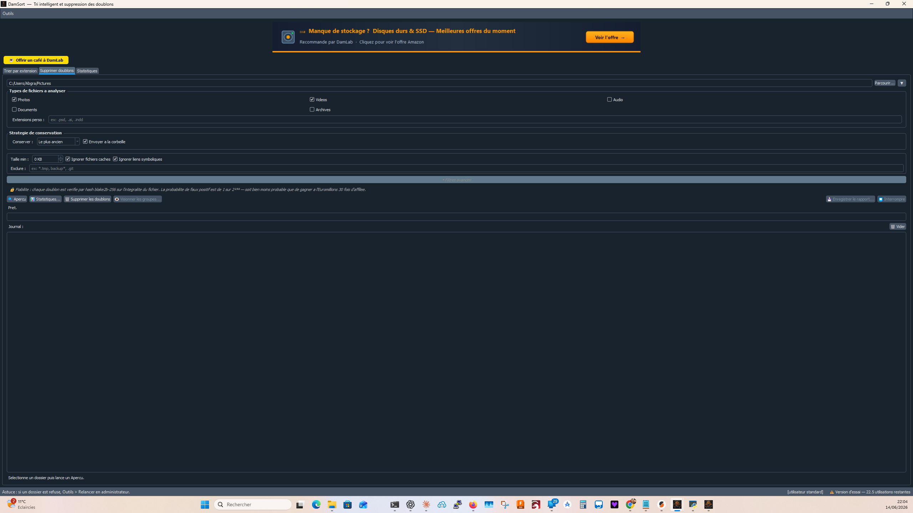
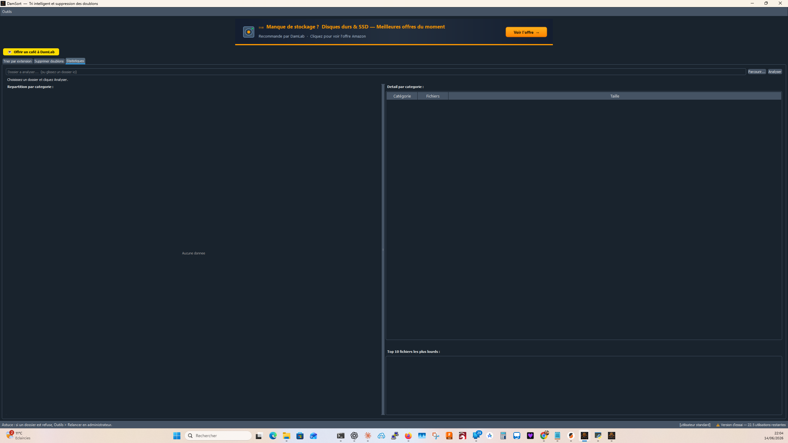

# DamSort — Tri intelligent & suppression des doublons

> **Organisez vos fichiers en un clic.** DamSort trie automatiquement par extension, détecte et supprime les doublons, et affiche des statistiques détaillées sur vos dossiers.

**[⬇ Télécharger](https://github.com/dam4129/DamSort/releases/latest)** · **[☕ Soutenir le projet](https://buymeacoffee.com/daminformat)** · **[🌐 Site officiel](https://lelabodedam.com/)**

---

## Aperçu

| Tri par extension | Suppression des doublons | Statistiques |
|:-----------------:|:------------------------:|:------------:|
|  |  |  |

---

## Fonctionnalités

### Tri par extension
- Sélectionnez un dossier source et une destination
- DamSort crée automatiquement des sous-dossiers par type (`Images/`, `Documents/`, `Vidéos/`…)
- Glisser-déposer de dossiers supporté
- Annulation possible après le tri
- Dossiers récents mémorisés

### Suppression des doublons
- Détection par hash SHA-256 (comparaison exacte du contenu)
- Aperçu des fichiers en double avant suppression
- Envoi dans la corbeille (récupération possible)
- Multi-thread pour les gros volumes

### Statistiques du dossier
- Répartition par type de fichier
- Taille totale, nombre de fichiers, fichiers en double
- Graphique visuel intégré

### Compteurs & partage
- Compteur cumulatif de fichiers déplacés
- Compteur cumulatif de doublons supprimés
- Partage en un clic sur **Facebook** et **X (Twitter)**

---

## Système de licence

DamSort est **freemium** :

| Mode | Fonctionnalités |
|------|----------------|
| **Gratuit** | 30 utilisations offertes |
| **Activé** | Utilisations illimitées |

Pour activer : achetez une clé sur [Buy Me a Coffee](https://buymeacoffee.com/daminformat) ou sur [lelabodedam.com](https://lelabodedam.com/).

---

## Installation

1. Téléchargez `DamSort_Setup_v1.2.exe` depuis les [Releases](https://github.com/dam4129/DamSort/releases/latest)
2. Lancez l'installateur (Windows 10/11)
3. DamSort s'installe et crée un raccourci bureau

> **Mise à jour** : relancez simplement le nouvel installateur — pas besoin de désinstaller l'ancienne version.

---

## Mise à jour automatique

Au démarrage, DamSort vérifie automatiquement si une nouvelle version est disponible. Une notification s'affiche si une mise à jour est prête.

---

## Nos logiciels

DamSort fait partie de la suite **DamLab** :

| Logiciel | Description |
|----------|-------------|
| **DamSort** *(ce logiciel)* | Tri de fichiers & suppression des doublons |
| **DamSort Audio** | Rangement intelligent de bibliothèques audio |
| **PhotoSort** | Organisation automatique de photos |

---

## Contact & Support

- **Site** : [lelabodedam.com](https://lelabodedam.com/)
- **Email** : daminformatique29@gmail.com
- **Support** : [buymeacoffee.com/daminformat](https://buymeacoffee.com/daminformat)

---

Fait avec ❤️ par <strong>DamLab</strong>

