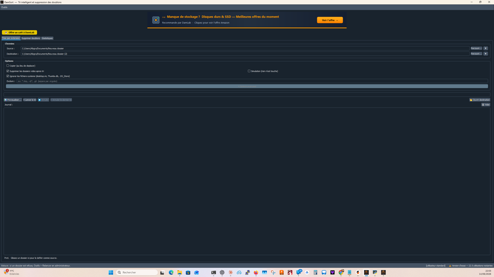
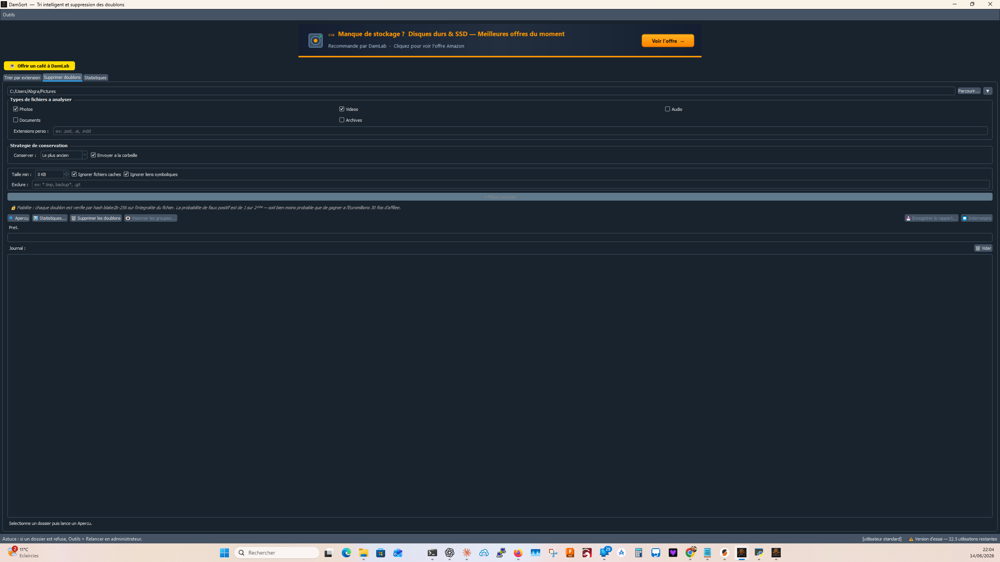
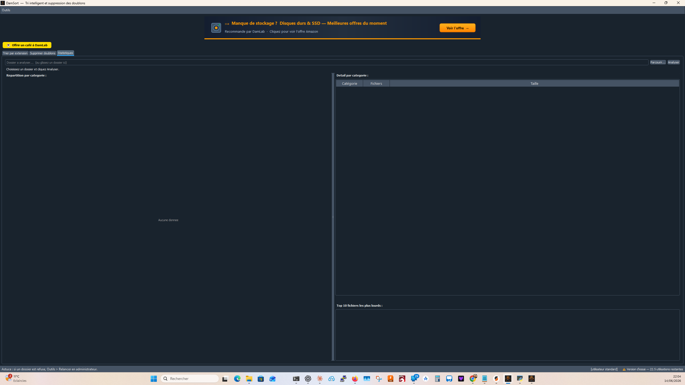

# DamSort — Tri intelligent & suppression des doublons

> **Organisez vos fichiers en un clic.** DamSort trie automatiquement par extension, détecte et supprime les doublons, et affiche des statistiques détaillées sur vos dossiers.

**[⬇ Télécharger](https://github.com/dam4129/DamSort/releases/latest)** · **[🌐 Site officiel](https://lelabodedam.com/)**

---

## Aperçu

| Tri par extension | Suppression des doublons | Statistiques |
|:-----------------:|:------------------------:|:------------:|
|  |  |  |

---

## Fonctionnalités

### Tri par extension
- Sélectionnez un dossier source et une destination
- DamSort crée automatiquement des sous-dossiers par type (`Images/`, `Documents/`, `Vidéos/`…)
- Glisser-déposer de dossiers supporté
- Annulation possible après le tri
- Dossiers récents mémorisés

### Suppression des doublons
- Détection par hash SHA-256 (comparaison exacte du contenu)
- Aperçu des fichiers en double avant suppression
- Envoi dans la corbeille (récupération possible)
- Multi-thread pour les gros volumes

### Statistiques du dossier
- Répartition par type de fichier
- Taille totale, nombre de fichiers, fichiers en double
- Graphique visuel intégré

### Compteurs & partage
- Compteur cumulatif de fichiers déplacés
- Compteur cumulatif de doublons supprimés
- Partage en un clic sur **Facebook** et **X (Twitter)**

### Mise à jour automatique
Au démarrage, DamSort vérifie s'il existe une version plus récente et vous prévient.

---

## Gratuit pour toujours

DamSort n'expire pas et ne compte pas vos lancements. La version gratuite traite **jusqu'à 50 fichiers par opération** — largement de quoi ranger un dossier de téléchargements au quotidien.

| Formule | Ce que vous obtenez |
|---------|--------------------|
| **Gratuit** | 50 fichiers par tri et par nettoyage de doublons — sans limite de durée |
| **Abonné — 3,99 €/an** | Fichiers illimités : un dossier entier en une seule opération |

L'aperçu et la simulation restent **toujours complets**, même en version gratuite : vous voyez l'intégralité de ce qui serait rangé avant de décider.

Pour vous abonner : dans le logiciel, menu **Outils → Passer en illimité**, ou sur [lelabodedam.com](https://lelabodedam.com/).

---

## Installation

1. Téléchargez `DamSort_Setup_v1.5.exe` depuis les [Releases](https://github.com/dam4129/DamSort/releases/latest)
2. Lancez l'installateur (Windows 10/11)
3. DamSort s'installe et crée un raccourci bureau

> **Mises à jour suivantes** : DamSort s'en charge. Il télécharge la nouvelle version en tâche de fond et l'installe en un clic, sans passer par le navigateur. Une pastille apparaît dans la barre de statut quand elle est prête.

---

## Nos logiciels

DamSort fait partie de la suite **DamLab** :

| Logiciel | Description |
|----------|-------------|
| **DamSort** *(ce logiciel)* | Tri de fichiers & suppression des doublons |
| **DamSort Audio** | Rangement intelligent de bibliothèques audio |
| **PhotoSort** | Organisation automatique de photos |

---

## Contact & Support

- **Site** : [lelabodedam.com](https://lelabodedam.com/)
- **Email** : daminformatique29@gmail.com
- **Support** : [buymeacoffee.com/daminformat](https://buymeacoffee.com/daminformat)

---

Fait avec ❤️ par <strong>DamLab</strong>

